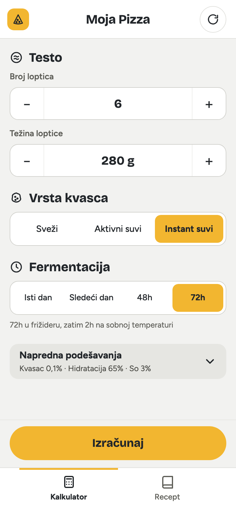
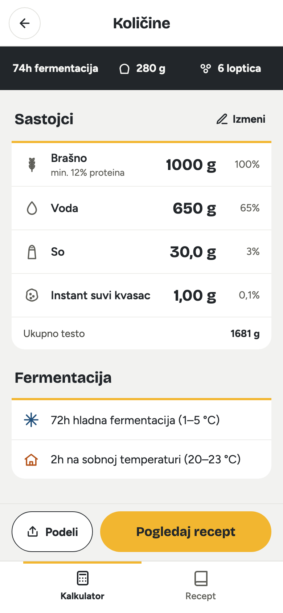
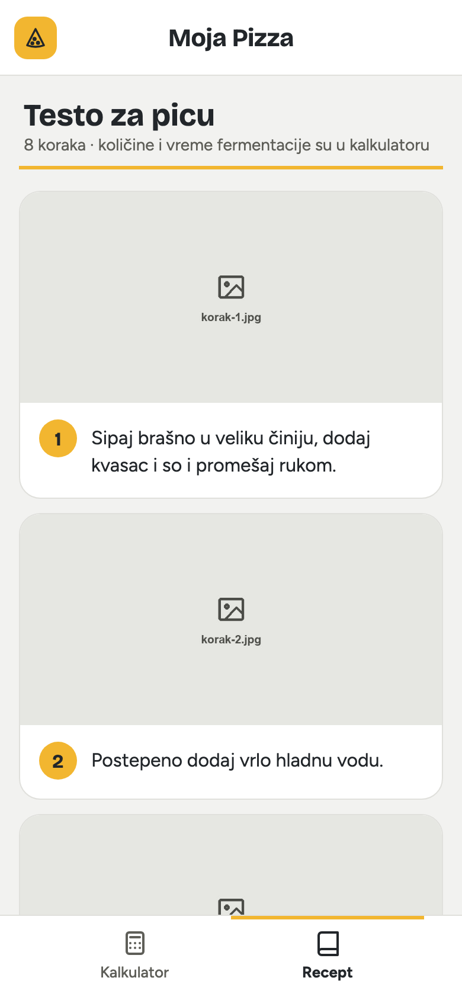

# Moja Pizza

A pizza dough calculator in Serbian. Choose the number of dough balls, the ball weight, the yeast type and the proofing schedule, and it gives exact grams of flour, water, salt and yeast for the batch, along with an illustrated dough recipe.

**Live:** https://zeksdev.github.io/PizzaCalculator/

It's an installable PWA that works offline after the first visit. On a phone, open the link and use "Add to Home Screen".

The defaults reproduce the source recipe: 6 × 280 g, instant dry yeast, 72h proofing → 1000 g flour, 650 g water, 30 g salt, 1 g yeast.

<p>
  
  
  
</p>

## Development

Requires Node 24.

```bash
npm install
npm run dev
```

The dev server serves the app at http://localhost:5173/PizzaCalculator/.

| Command | What it does |
|---|---|
| `npm run dev` | Start the dev server |
| `npm test` | Run the full Vitest suite |
| `npx vitest run src/App.test.tsx` | Run a single test file (add `-t "<name>"` for one test) |
| `npm run typecheck` | Check types |
| `npm run build` | Typecheck and build to `dist/`, including the service worker |
| `npm run preview` | Serve the production build locally |

## Deployment

Every push to `main` runs [`.github/workflows/deploy.yml`](.github/workflows/deploy.yml), which tests, builds and deploys to GitHub Pages.

## Recipe photos

The recipe steps use placeholder photos in `public/recept/korak-1.jpg` … `korak-8.jpg`. To use your own photo for a step, replace its file and keep the name.

## Project docs

- [`CONTEXT.md`](CONTEXT.md): the domain glossary
- [`docs/adr/`](docs/adr/): decision records
- [`CLAUDE.md`](CLAUDE.md): guidance for working on the code

## License

[MIT](LICENSE)
